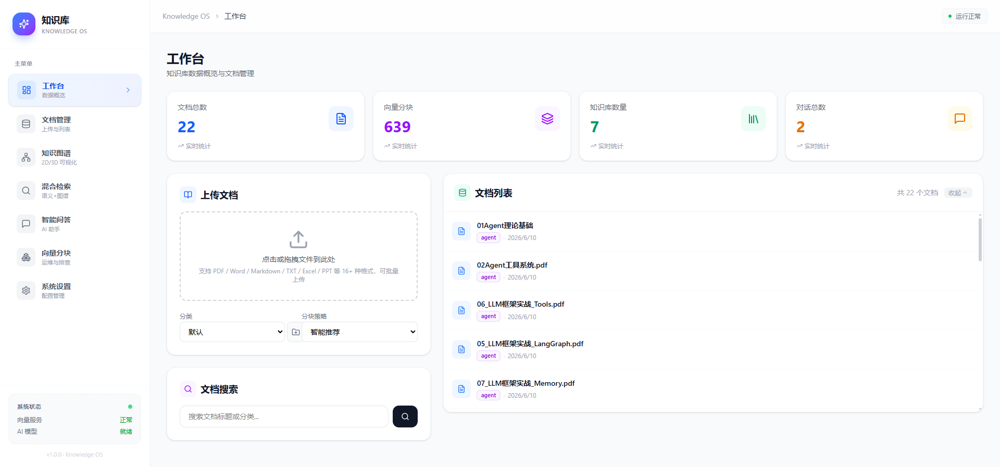
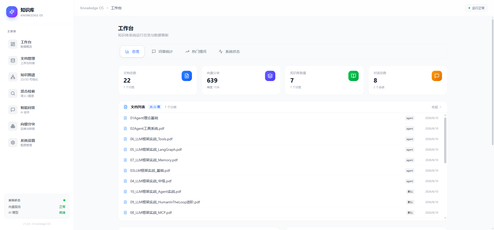
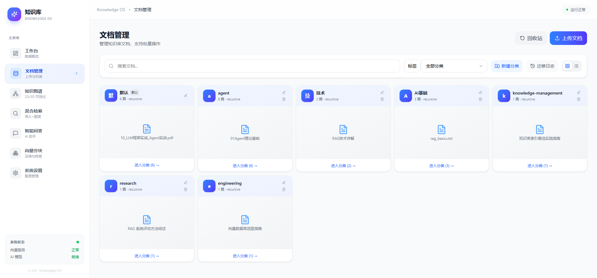
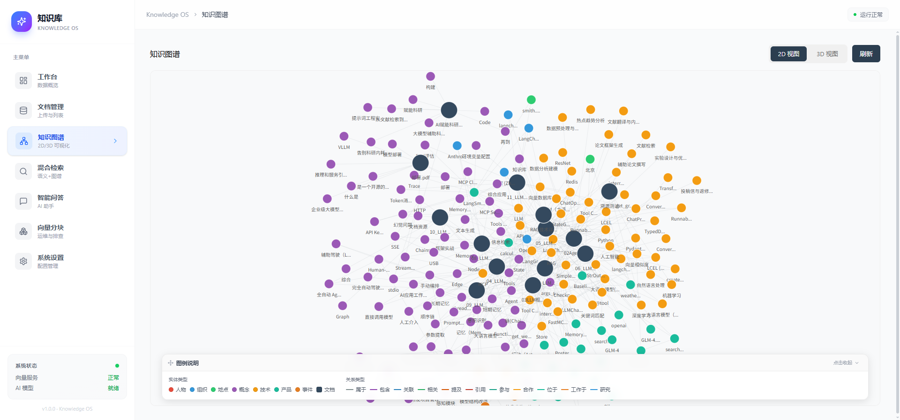
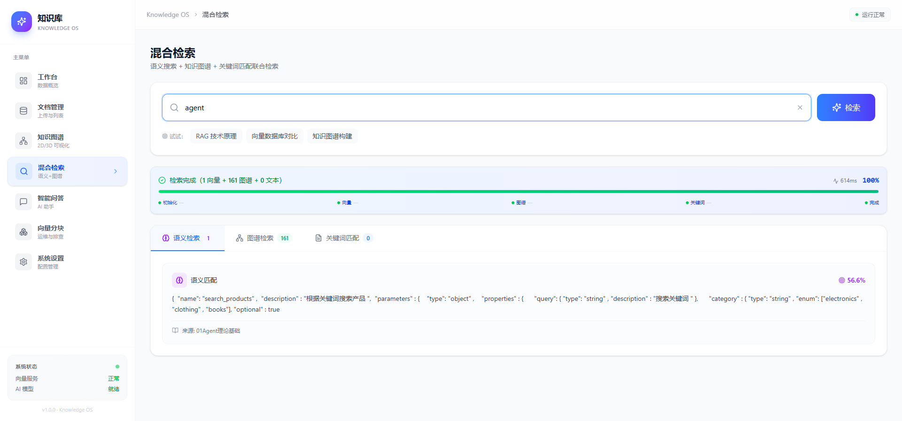
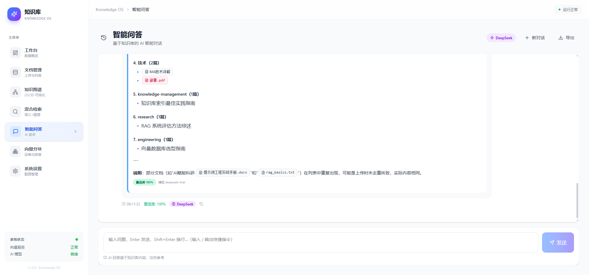
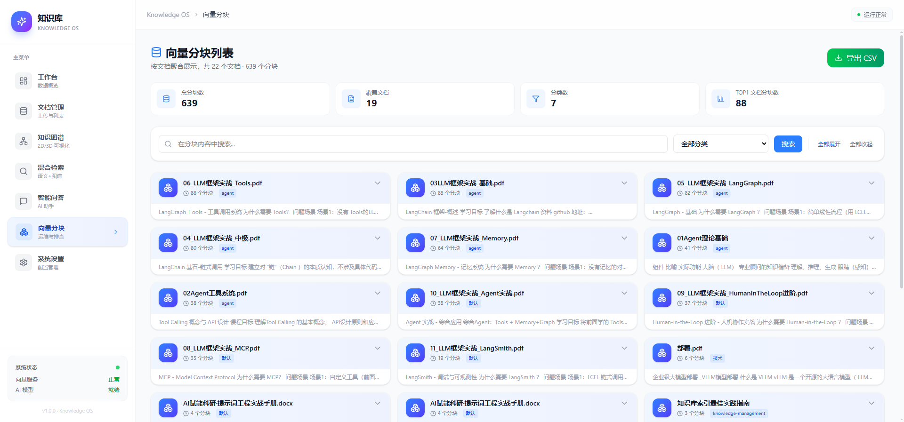
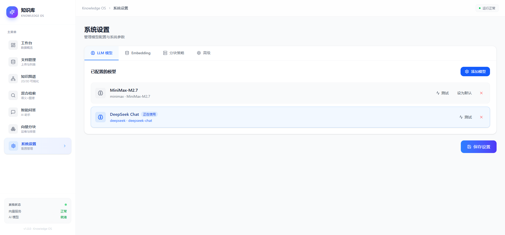

# Knowledge OS · 智能知识库系统

> 基于 RAG + 知识图谱 + 智能问答的个人/团队知识中枢  
> 让每一份文档都能被精准检索、深度理解和智能复用

<!-- 任务 P3-10：完整技术栈 badge（与 requirements.txt / package.json 严格一致） -->
[](https://www.python.org/)
[](https://fastapi.tiangolo.com/)
[](https://www.sqlalchemy.org/)
[](https://www.trychroma.com/)
[](https://react.dev/)
[](https://www.typescriptlang.org/)
[](https://vitejs.dev/)
[](https://tailwindcss.com/)
[](https://threejs.org/)
[](https://networkx.org/)
[](LICENSE)

---

## 一、项目简介

**Knowledge OS** 是一个面向个人与小团队的智能知识库系统，提供文档导入、向量化存储、混合检索（语义+图谱）、知识图谱可视化、AI 智能问答等一站式能力。系统采用前后端分离架构，后端基于 FastAPI + ChromaDB（向量库）+ SQLite（关系库），前端基于 React + Vite + TailwindCSS，配合硅基流动等多家大模型/Embedding 服务实现生产可用的 RAG 系统。

### 核心能力一览

- **📄 多格式文档管理**：PDF / DOCX / TXT / MD 解析入库，自动切片、编码、索引
- **🧠 语义检索**：基于向量相似度的 Top-K 检索，跨语言语义匹配
- **🔗 混合检索**：向量 + 关键词 + 知识图谱三路融合，相关性 + 权威性双重保障
- **💬 智能问答**：基于检索增强的 LLM 对话，支持引用溯源、流式输出
- **🕸 知识图谱**：文档/分块/概念三层级关系抽取，2D / 3D 可视化浏览
- **🏷 分类与标签**：多维分类（chunk 策略）、自定义标签、跨文档标签云
- **📚 参考文献**：学术引用管理，APA / GB/T 7714 多样式导出
- **🗑 回收站**：误删文档可恢复，30 天自动清理
- **📊 数据看板**：文档量、chunks 数、引用分布、检索热词一图掌握
- **⚙️ 多 Provider 适配**：OpenAI / 硅基流动 / 通义千问 / 智谱 / Ollama / 本地 BGE 一键切换

### 适用场景

- 📚 个人学习笔记：跨学科论文、教程、参考资料的智能问答
- 🏢 小团队文档：产品需求、技术方案、API 文档的统一检索入口
- 🔬 学术研究：文献综述、参考文献管理、引用关系图谱
- 🤖 AI 应用开发：作为 RAG 中间件集成到业务系统

---

## 二、环境依赖

### 2.1 系统级依赖

| 组件 | 最低版本 | 推荐版本 | 用途 |
|------|---------|---------|------|
| **操作系统** | Windows 10 / Linux | Linux (Ubuntu 20.04+) | 推荐 Linux 部署 |
| **CPU** | 2 核 | 4 核+ | 多 worker 部署需要 |
| **内存** | 4 GB | 8 GB+ | 加载 Embedding 模型 / LLM 响应缓存 |
| **磁盘** | 10 GB | 20 GB+ | ChromaDB / 文档 / 上传文件 |
| **Python** | 3.10 | 3.11+ | 后端运行时 |
| **Node.js** | 18 | 20+ | 前端构建 |
| **SQLite** | 3.35 | 3.40+ | 数据持久化 |

### 2.2 Python 依赖（与 [requirements.txt](backend/requirements.txt) 严格一致）

| 包 | 版本 | 用途 |
|------|------|------|
| **fastapi** | 0.115.0 | Web 框架（路由、中间件、自动 OpenAPI 文档） |
| **uvicorn[standard]** | 0.32.0 | ASGI 服务器（生产部署） |
| **SQLAlchemy** | 2.0.21 | ORM（关系型数据持久化） |
| **pydantic** | 2.9.0 | 数据校验 / Schema |
| **chromadb** | 0.5.20 | 向量数据库（语义检索核心） |
| **openai** | 1.55.0 | OpenAI 兼容 SDK（适配硅基流动/DeepSeek/通义千问等） |
| **sentence-transformers** | 3.3.0 | Embedding 模型（本地备选） |
| **networkx** | 3.4.0 | 知识图谱构建与图算法 |
| **numpy / scikit-learn** | 2.1.0 / 1.5.0 | 向量运算、TF-IDF、相似度 |
| **tiktoken** | 0.8.0 | Token 计数（成本估算） |
| **PyPDF2 / python-docx / chardet** | - | 多格式文档解析 |
| **PyJWT / passlib[bcrypt]** | 2.9.0 / 1.7.4 | **JWT 认证 + 密码哈希** |
| **python-multipart** | 0.0.17 | 文件上传支持 |

### 2.3 前端依赖（与 [package.json](frontend/package.json) 严格一致）

| 包 | 版本 | 用途 |
|------|------|------|
| **react / react-dom** | 18.3.0 | UI 框架 |
| **react-router-dom** | 6.28.0 | SPA 路由 |
| **@antv/g6** | 5.0.0 | **2D 知识图谱可视化**（不是 d3） |
| **three** | 0.170.0 | WebGL 3D 引擎 |
| **3d-force-graph** | 1.73.0 | **3D 知识图谱（力导向布局）** |
| **react-markdown** | 10.1.0 | AI 回答的 Markdown 渲染（含表格、代码块） |
| **remark-gfm** | 4.0.0 | GitHub Flavored Markdown 扩展 |
| **axios** | 1.7.0 | HTTP 客户端 |
| **lucide-react** | 0.468.0 | 图标库 |
| **tailwindcss** | 4.3.0 | 原子化 CSS（**注意：v4 配置与 v3 不同**） |
| **typescript** | 5.6.0 | 类型系统（编译时校验） |
| **vite** | 5.4.0 | 构建工具（ESM、HMR、生产打包） |

### 2.4 外部服务（必选其一）

| 服务 | 用途 | 申请地址 |
|------|------|---------|
| **硅基流动 SiliconFlow** | Embedding + LLM | https://siliconflow.cn （注册送 2000 万 Tokens） |
| OpenAI | Embedding + LLM | https://platform.openai.com |
| 通义千问 DashScope | Embedding + LLM | https://dashscope.aliyun.com |
| 智谱 GLM | Embedding + LLM | https://bigmodel.cn |
| Ollama（本地） | Embedding | https://ollama.com |

---

## 二点五、技术架构

```
┌──────────────────────────────────────────────────────────────────┐
│                         前端 (Browser)                            │
│  React 18 + TypeScript 5.6 + Vite 5.4 + TailwindCSS 4.3         │
│  ┌────────────┬────────────┬────────────┬────────────┐          │
│  │ 工作台     │ 文档管理   │ 智能问答   │ 知识图谱   │          │
│  │ Dashboard  │ Documents  │ Chat       │ Graph(G6+3D)│          │
│  └────────────┴────────────┴────────────┴────────────┘          │
│  HTTP (axios) ←→ WebSocket/SSE（流式 AI 回答）                  │
└──────────────────────────────────────────────────────────────────┘
                                ↕ HTTPS / SSE
┌──────────────────────────────────────────────────────────────────┐
│              后端 (FastAPI 0.115 + Uvicorn 0.32)                │
│  ┌────────────── API 层 (REST + SSE) ──────────────┐            │
│  │ /api/ai/ask · /api/ai/ask/stream · /api/ai/ask/async │      │
│  │ /api/documents · /api/search · /api/embedding        │      │
│  │ /api/graph · /api/auth (JWT) · /api/admin            │      │
│  └────────────────────────────────────────────────────┘          │
│  ┌────────────── 核心服务层 ─────────────────────────┐          │
│  │ RAGChainService（检索增强生成）                       │          │
│  │ LLMChainService（多 Provider 适配）                   │          │
│  │ HybridRetriever（向量 + 关键词 + 图谱）              │          │
│  │ DocumentChunker（递归/结构/语义/智能 等 14 种策略） │          │
│  │ KnowledgeProvider（动态知识模板，0 硬编码）          │          │
│  └────────────────────────────────────────────────────┘          │
└──────────────────────────────────────────────────────────────────┘
                                ↕
┌────────────────┬─────────────────┬─────────────────┐
│  ChromaDB      │  SQLite         │  NetworkX       │
│  (向量索引)    │  (关系数据)     │  (知识图谱)      │
│  0.5.20        │  + SQLAlchemy   │  3.4.0          │
│                │  2.0.21         │  (内存/JSON)     │
└────────────────┴─────────────────┴─────────────────┘
```

### 二点六、关键设计点

| 设计点 | 选型理由 |
|--------|----------|
| **多 Provider LLM 适配** | 用 OpenAI 兼容 SDK（不是 LangChain），代码量少 60%，无抽象税；可同时支持硅基流动/DeepSeek/通义千问/智谱/Ollama |
| **Hybrid Retriever** | 纯向量检索会漏"完全相同关键词但语义不同"；纯关键词会漏"近义不同词"；混合 = 向量 + BM25 + 图谱邻居 |
| **流式响应（SSE）** | LLM 响应慢（5~30s），SSE 让用户看到打字机效果；同时支持 `/ask/async` 轮询模式（页面切走也不中断） |
| **本地 Embedding + 云端 LLM** | Embedding 计算密集 → sentence-transformers 本地；LLM 调用 → 云端（成本/质量平衡） |
| **JWT 认证** | 无状态，前后端解耦；后端无需 session 存储；支持移动端/CLI 客户端 |
| **NetworkX 内存图** | 个人/小团队数据量（< 10 万节点）完全够用，避免 Neo4j 等重依赖 |

### 二点七、项目结构

```
knowledge/
├── backend/                        # FastAPI 后端
│   ├── app/
│   │   ├── api/                   # REST API 路由（按域拆分）
│   │   │   ├── ai.py              # AI 问答（同步/流式/异步三模式）
│   │   │   ├── documents.py       # 文档管理 CRUD
│   │   │   ├── search.py          # 混合检索
│   │   │   ├── graph.py           # 知识图谱
│   │   │   ├── embedding.py       # Embedding 服务
│   │   │   ├── chunks.py          # 向量分块运维
│   │   │   ├── categories.py      # 分类管理
│   │   │   ├── tags.py            # 标签管理
│   │   │   ├── references.py      # 参考文献
│   │   │   ├── recycle.py         # 回收站
│   │   │   └── versions.py        # 文档版本
│   │   ├── core/                   # 核心服务
│   │   │   ├── rag_chain.py       # RAG 链式调用（核心）
│   │   │   ├── llm_chain.py       # LLM 多 Provider 封装
│   │   │   ├── hybrid_retriever.py # 混合检索器
│   │   │   ├── chunking.py        # 14 种分块策略
│   │   │   ├── vector_store.py    # ChromaDB 封装
│   │   │   ├── graph_store.py     # NetworkX 封装
│   │   │   ├── config.py          # 配置中心
│   │   │   ├── query_cache.py     # 查询缓存
│   │   │   ├── knowledge_provider.py # 动态知识模板
│   │   │   └── memory_chain.py    # 多轮对话记忆
│   │   ├── models/                 # SQLAlchemy ORM 模型
│   │   └── main.py                 # FastAPI 入口
│   ├── data/                       # 运行时数据（gitignore）
│   │   ├── chroma_db_v2/          # 向量索引
│   │   ├── knowledge.db           # 关系数据
│   │   └── uploads/               # 上传文档
│   ├── scripts/                    # 工具脚本
│   ├── tests/                      # 测试
│   ├── requirements.txt            # Python 依赖
│   ├── .env.example                # 环境变量模板
│   └── Dockerfile                  # Docker 镜像
│
├── frontend/                       # React + Vite 前端
│   ├── src/
│   │   ├── pages/                  # 页面（每个核心模块一个）
│   │   │   ├── DashboardPage.tsx
│   │   │   ├── DocumentsPage.tsx
│   │   │   ├── ChatPage.tsx
│   │   │   ├── GraphPage.tsx
│   │   │   ├── SearchPage.tsx
│   │   │   ├── ChunksPage.tsx
│   │   │   ├── SettingsPage.tsx
│   │   │   └── RecycleBinPage.tsx
│   │   ├── components/             # 业务组件
│   │   │   ├── AIChat.tsx         # AI 聊天组件
│   │   │   ├── RichContentRenderer.tsx # Markdown 渲染（含表格）
│   │   │   ├── FloatingAI.tsx     # 悬浮 AI 助手
│   │   │   └── KBToggle.tsx       # 知识库开关
│   │   ├── services/               # API/数据服务
│   │   │   ├── api.ts             # 后端 API 封装
│   │   │   ├── chatStreamManager.ts # SSE 流式管理
│   │   │   ├── aiTaskStore.ts     # 任务状态
│   │   │   └── tinyStore.ts       # 轻量状态管理
│   │   ├── types/                  # TypeScript 类型
│   │   └── main.tsx                # React 入口
│   ├── tests/                      # 前端测试
│   ├── package.json                # npm 依赖
│   ├── vite.config.ts              # Vite 配置
│   ├── tailwind.config.js          # TailwindCSS 配置
│   └── tsconfig.json               # TypeScript 配置
│
├── deploy/                         # 部署配置
│   ├── nginx/                      # Nginx 反向代理
│   ├── systemd/                    # systemd 服务
│   └── kb-backend.service          # 后端服务定义
│
├── docs/                           # 文档
│   ├── screenshots/                # 截图证据
│   ├── extract_*.py                # 截图提取脚本（开发用）
│   └── PITFALLS.md                 # 开发复盘总结
│
├── docker-compose.yml              # Docker 一键部署
├── .gitignore                      # Git 忽略规则
├── README.md                       # 本文档
└── PITFALLS.md                     # 项目复盘
```

---

## 三、安装与部署

### 3.1 克隆代码

```bash
git clone <repo-url> knowledge-base
cd knowledge-base
```

### 3.2 后端启动

```bash
cd backend

# 1. 创建虚拟环境
python -m venv venv
# Windows
.\venv\Scripts\activate
# Linux / macOS
source venv/bin/activate

# 2. 安装依赖
pip install -r requirements.txt

# 3. 配置环境变量
cp .env.example .env
# 编辑 .env，填入 SILICONFLOW_API_KEY 等
```

`.env` 关键配置项：

```ini
# Embedding 服务
EMBEDDING_MODE=api
EMBEDDING_PROVIDER=siliconflow
SILICONFLOW_API_KEY=sk-xxxx
EMBEDDING_MODEL_OVERRIDE=Qwen/Qwen3-VL-Embedding-8B

# 启动
HOST=0.0.0.0
PORT=8000
```

```bash
# 4. 启动后端
python -m uvicorn main:app --host 0.0.0.0 --port 8000
```

> 首次启动会自动迁移数据、初始化向量库（22 个文档，639 个 chunks）。

### 3.3 前端启动

```bash
cd frontend

# 1. 安装依赖
npm install

# 2. 开发模式（热重载）
npm run dev
# 默认地址：http://localhost:5173

# 3. 生产构建
npm run build
# 产物在 dist/ 目录
```

### 3.4 Docker 一键部署

```bash
# 启动
docker compose up -d

# 查看日志
docker compose logs -f

# 停止
docker compose down
```

### 3.5 生产部署（生产推荐）

详细文档见 [deploy/README.md](deploy/)，包含：
- **Nginx 反向代理**：[deploy/nginx.conf](deploy/nginx.conf) — GZip / HTTP/2 / SSL / 缓存
- **Systemd 守护**：[deploy/kb-backend.service](deploy/kb-backend.service) — 自动重启 / 资源限制

```bash
# 1. 上传代码
scp -r ./knowledge-base user@server:/opt/

# 2. 安装 systemd 服务
sudo cp deploy/kb-backend.service /etc/systemd/system/
sudo systemctl daemon-reload
sudo systemctl enable --now kb-backend

# 3. 安装 Nginx 配置
sudo cp deploy/nginx.conf /etc/nginx/sites-available/knowledge-base
sudo ln -s /etc/nginx/sites-available/knowledge-base /etc/nginx/sites-enabled/
sudo nginx -t && sudo systemctl reload nginx
```

---

## 四、模块功能说明

### 4.1 项目结构

```
knowledge-base/
├── backend/                        # 后端服务（FastAPI）
│   ├── main.py                     # 应用入口（含中间件、启动任务）
│   ├── start_prod.py               # 生产多 worker 启动器
│   ├── start_server.py             # 开发启动脚本
│   ├── requirements.txt
│   ├── Dockerfile
│   ├── .env.example
│   ├── app/
│   │   ├── api/                    # API 路由层（12 个模块）
│   │   │   ├── documents.py        # 文档管理 API
│   │   │   ├── search.py           # 检索 API
│   │   │   ├── graph.py            # 知识图谱 API
│   │   │   ├── ai.py               # AI 问答 API
│   │   │   ├── chunks.py           # 向量分块 API
│   │   │   ├── embedding.py        # Embedding 信息 API
│   │   │   ├── knowledge_bases.py  # 知识库元信息 API
│   │   │   ├── categories.py       # 分类管理 API
│   │   │   ├── tags.py             # 标签管理 API
│   │   │   ├── references.py       # 参考文献 API
│   │   │   ├── versions.py         # 文档版本 API
│   │   │   └── recycle.py          # 回收站 API
│   │   ├── core/                   # 核心业务逻辑
│   │   │   ├── vector_store.py     # ChromaDB 封装 + 动态 collection
│   │   │   ├── embedding.py        # Embedding 适配器（10+ provider）
│   │   │   ├── chunking.py         # 高级分块策略
│   │   │   ├── llm.py              # LLM 适配器
│   │   │   ├── llm_chain.py        # LangChain RAG 链
│   │   │   ├── rag_chain.py        # 检索增强生成链
│   │   │   ├── memory.py           # 会话记忆
│   │   │   ├── query_cache.py      # LRU 查询缓存
│   │   │   ├── intent_classifier.py# 意图识别
│   │   │   ├── ai_tasks.py         # 异步任务队列
│   │   │   ├── versioning.py       # 文档版本管理
│   │   │   ├── references.py       # 参考文献管理
│   │   │   ├── recycle_bin.py      # 回收站实现
│   │   │   ├── tags.py             # 标签系统
│   │   │   ├── models.py           # SQLAlchemy ORM
│   │   │   ├── db.py               # 数据库连接池
│   │   │   ├── config.py           # 配置中心
│   │   │   └── system_faq*.py      # 系统 FAQ 自动入库
│   │   ├── services/               # 服务层
│   │   │   ├── document_service.py # 文档业务编排
│   │   │   ├── document_parser.py  # 多格式文档解析
│   │   │   ├── search_service.py   # 搜索编排
│   │   │   ├── knowledge_base.py   # KB 元数据
│   │   │   └── knowledge_graph.py  # 知识图谱构建
│   │   └── models/                 # Pydantic 模型
│   └── data/                       # 数据目录（运行时生成）
│       ├── chroma_db_v2/           # ChromaDB 持久化
│       ├── uploads/                # 用户上传文件
│       ├── kb.db                   # SQLite 主库
│       └── *.json                  # 备份/配置
├── frontend/                       # 前端应用（React + Vite）
│   ├── package.json
│   ├── vite.config.ts
│   ├── tailwind.config.js
│   ├── index.html
│   └── src/
│       ├── main.tsx                # 应用入口
│       ├── App.tsx                 # 路由配置
│       ├── pages/                  # 9 个一级页面
│       ├── components/             # 18 个复用组件
│       ├── contexts/               # 跨页状态（KBContext）
│       ├── services/               # API 客户端、Store、流式管理
│       ├── types/                  # TypeScript 类型定义
│       └── data/                   # 静态数据
├── deploy/                         # 生产部署
│   ├── nginx.conf                  # Nginx 反代 + GZip + SSL
│   └── kb-backend.service         # systemd 服务
├── docs/                           # 文档与截图
│   └── screenshots/                # 各页面截图
├── docker-compose.yml              # 容器编排
├── PITFALLS.md                     # 踩坑记录（开发问题汇总）
└── README.md                       # 本文档
```

### 4.2 后端核心模块

#### 4.2.1 Embedding 适配器 [app/core/embedding.py](backend/app/core/embedding.py)

**职责**：统一封装 10+ 主流 Embedding 服务，按维度自动隔离向量库。

**核心设计**：
- **Provider 注册表**：`EMBEDDING_PROVIDERS` 字典描述每家厂商的协议、维度、API key 环境变量
- **动态 collection 命名**：`_get_collection_name()` 根据当前维度返回 `chunks_d{dim}`，避免维度冲突
- **协议适配**：`openai` / `minimax` / `local` / `local_qwen3` 4 套适配逻辑

**关键能力**：
| Provider | 模型 | 维度 | 协议 |
|----------|------|------|------|
| 硅基流动 | Qwen/Qwen3-VL-Embedding-8B | 4096 | OpenAI |
| OpenAI | text-embedding-3-small | 1536 | OpenAI |
| 智谱 | embedding-2 | 1024 | OpenAI |
| 通义千问 | text-embedding-v3 | 1024 | OpenAI |
| Ollama | nomic-embed-text | 768 | OpenAI |
| 本地 BGE | bge-small-zh-v1.5 | 512 | sentence-transformers |
| 本地 Qwen3 | Qwen3-Embedding-0.6B | 1024 | transformers |

#### 4.2.2 向量存储 [app/core/vector_store.py](backend/app/core/vector_store.py)

**职责**：封装 ChromaDB 的增删改查、增量重建、自动迁移。

**核心能力**：
- `reindex_all_documents()`：全量重建（带 `FORCE_FULL_REINDEX=1` 强制开关）
- `migrate_json_to_chroma()`：从旧 `vector_store.json` 自动迁移（一次性、幂等）
- `encode_query()` / `add_chunk()`：单点操作
- **启动自检**：比对文档数 vs 已索引数，缺失自动增量重建
- **维度隔离**：按 `chunks_d{dim}` 命名，切换 provider 不破坏老数据

#### 4.2.3 文档解析 [app/services/document_parser.py](backend/app/services/document_parser.py)

**支持格式**：

| 格式 | 解析器 | 提取项 |
|------|--------|-------|
| PDF | pdfplumber | 文本 + 表格 + 元数据 |
| DOCX | python-docx | 段落 + 标题 + 表格 |
| TXT / MD | 直接读取 | 纯文本 |
| 图片（PDF 内嵌） | 预留 | 多模态扩展点 |

#### 4.2.4 高级分块 [app/core/chunking.py](backend/app/core/chunking.py)

**策略**：
- **固定窗口**：500 tokens 窗口 + 50 tokens 重叠
- **语义分块**：按段落/标题自然切分
- **结构感知**：识别 Markdown 标题层级，保留上下文
- **批量嵌入**：先收集 chunks，再批量调用 Embedding API（节省 HTTP 握手）

#### 4.2.5 RAG 链 [app/core/rag_chain.py](backend/app/core/rag_chain.py)

**流转**：
```
用户问题
  ↓
[意图识别] intent_classifier → 检索 / 问答 / 闲聊
  ↓
[混合检索] vector + keyword + graph → Top-K chunks
  ↓
[查询缓存] query_cache（LRU 200 条）→ 命中直接返回
  ↓
[Prompt 构造] chunks 注入 prompt 模板
  ↓
[LLM 流式生成] → SSE 流式响应
  ↓
[引用溯源] 把 chunk 引用附加到答案
  ↓
返回客户端
```

#### 4.2.6 知识图谱 [app/services/knowledge_graph.py](backend/app/services/knowledge_graph.py)

**存储**：
- **节点**：文档节点 / Chunk 节点 / 概念节点
- **边**：包含（chunk→doc）、相关（chunk↔chunk）、提及（chunk→concept）
- **持久化**：NetworkX + JSON 持久化到 `data/graph/`

**构建**：
- 文档入库时自动触发（异步任务）
- 共现分析 + 关键词提取（基于 LLM）

#### 4.2.7 异步任务 [app/core/ai_tasks.py](backend/app/core/ai_tasks.py)

**设计**：基于 asyncio.Queue 的轻量任务队列，**避免引入 Celery / Redis**。

**任务类型**：
- `EMBED_TASK`：文档分块嵌入
- `GRAPH_TASK`：知识图谱构建
- `SUMMARY_TASK`：文档摘要生成
- `REINDEX_TASK`：增量重建

#### 4.2.8 审计日志 [app/core/audit.py](backend/app/core/audit.py)

所有 API 调用、文档操作、配置变更记录到 `data/audit.log`，便于问题排查。

### 4.3 前端核心模块

#### 4.3.1 页面清单

| 路由 | 页面 | 核心功能 |
|------|------|---------|
| `/` | [HomePage](frontend/src/pages/HomePage.tsx) | 工作台首页 |
| `/dashboard` | [DashboardPage](frontend/src/pages/DashboardPage.tsx) | 数据概览 |
| `/documents` | [DocumentsPage](frontend/src/pages/DocumentsPage.tsx) | 文档管理 |
| `/graph` | [GraphPage](frontend/src/pages/GraphPage.tsx) | 知识图谱 |
| `/search` | [SearchPage](frontend/src/pages/SearchPage.tsx) | 混合检索 |
| `/chat` | [ChatPage](frontend/src/pages/ChatPage.tsx) | 智能问答 |
| `/chunks` | [ChunksPage](frontend/src/pages/ChunksPage.tsx) | 向量分块运维 |
| `/settings` | [SettingsPage](frontend/src/pages/SettingsPage.tsx) | 系统设置 |
| `/recycle-bin` | [RecycleBinPage](frontend/src/pages/RecycleBinPage.tsx) | 回收站 |

#### 4.3.2 各页面截图与功能说明

##### ① 工作台首页 `http://localhost:5173/`



- **页面模块**：系统状态卡片、快捷入口、推荐知识库
- **核心交互**：点击侧边栏切换模块、点击卡片跳转对应功能
- **使用场景**：用户进入系统的第一屏，快速了解系统状态和入口

##### ② 数据概览 `http://localhost:5173/dashboard`



- **页面模块**：文档统计、chunks 统计、引用分布、检索热词云
- **核心交互**：图表悬浮查看详情、点击图表项过滤
- **使用场景**：管理员/运营查看系统整体使用情况

##### ③ 文档管理 `http://localhost:5173/documents`



- **页面模块**：文档列表、分类侧栏、搜索框、拖拽上传区
- **核心交互**：
  - 拖拽文件到指定区域触发上传
  - 列表行点击进入文档详情
  - 多选 + 批量操作（删除、归类、贴标签）
- **使用场景**：日常文档管理主入口

##### ④ 知识图谱 `http://localhost:5173/graph`



- **页面模块**：2D/3D 图谱视图、图例、节点详情侧栏
- **核心交互**：
  - 2D/3D 切换（Three.js 3D 渲染）
  - 拖拽旋转、滚轮缩放
  - 节点点击查看关联文档
  - 顶部筛选条按分类/标签过滤
- **使用场景**：探索文档间隐性关联、发现主题聚类

##### ⑤ 混合检索 `http://localhost:5173/search`



- **页面模块**：搜索框、结果列表、命中高亮、筛选侧栏
- **核心交互**：
  - 实时输入联想（200ms debounce）
  - 结果按相关性/时间排序切换
  - 点击 chunk 跳转到所在文档
- **使用场景**：精准定位知识（相比问答更精确）

##### ⑥ 智能问答 `http://localhost:5173/chat`



- **页面模块**：历史对话栏、主对话区、引用来源、置信度展示
- **核心交互**：
  - 输入框 `/` 唤出快捷指令（清空、导出、新建对话）
  - 流式响应（SSE）：逐字显示答案
  - 引用来源：每条答案标注 chunk 来源 + 相似度
  - 置信度：根据检索相似度综合计算
- **使用场景**：日常 RAG 对话、智能问答

##### ⑦ 向量分块 `http://localhost:5173/chunks`



- **页面模块**：Chunks 列表、向量统计、检索测试
- **核心交互**：
  - 按文档过滤 chunks
  - 在线测试 chunk 内容（查看是否被正确分块）
  - 触发增量重建
- **使用场景**：运维排查（分块质量、检索精度调优）

##### ⑧ 系统设置 `http://localhost:5173/settings`



- **页面模块**：当前 Embedding 模型展示、Provider 列表、配置保存
- **核心交互**：
  - 查看当前生效的 Embedding 信息
  - 浏览所有可用 Provider
  - 一键切换 Provider（需重启）
- **使用场景**：管理员切换 Embedding 服务、监控配置

#### 4.3.3 关键组件

| 组件 | 路径 | 职责 |
|------|------|------|
| [Layout.tsx](frontend/src/components/Layout.tsx) | 顶部 + 侧边栏 | 全局布局 |
| [AIChat.tsx](frontend/src/components/AIChat.tsx) | 智能问答组件 | 流式对话 + 引用 |
| [Graph2D.tsx](frontend/src/components/Graph2D.tsx) | 2D 图谱 | D3 力导向图 |
| [Graph3D.tsx](frontend/src/components/Graph3D.tsx) | 3D 图谱 | Three.js 球面布局 |
| [DragUpload.tsx](frontend/src/components/DragUpload.tsx) | 拖拽上传 | 多文件 + 进度 |
| [SearchProgress.tsx](frontend/src/components/SearchProgress.tsx) | 检索进度 | 多步进度可视化 |
| [SlashCommandPicker.tsx](frontend/src/components/SlashCommandPicker.tsx) | 斜杠指令 | 快捷操作菜单 |
| [KBContext.tsx](frontend/src/contexts/KBContext.tsx) | 跨页状态 | 当前知识库 |

#### 4.3.4 API 客户端与服务层

- [services/api.ts](frontend/src/services/api.ts) — Axios 实例 + 错误处理
- [services/chatStreamManager.ts](frontend/src/services/chatStreamManager.ts) — SSE 流式解析
- [services/tinyStore.ts](frontend/src/services/tinyStore.ts) — 轻量状态管理（Zustand 风格）

---

## 五、技术架构

### 5.1 整体架构图

```
┌─────────────────────────────────────────────────────────────┐
│                    浏览器（React 18 SPA）                      │
│  ┌─────────┬─────────┬─────────┬─────────┬─────────┐         │
│  │ 工作台  │ 文档    │ 图谱    │ 检索    │ 问答    │ ...     │
│  └────┬────┴────┬────┴────┬────┴────┬────┴────┬────┘         │
│       └─────────┴──────────┴────────┴─────────┘              │
│                         ↓ HTTP / SSE                         │
└─────────────────────────────┬───────────────────────────────┘
                              ↓ (代理)
┌─────────────────────────────┴───────────────────────────────┐
│           Nginx (反向代理 + GZip + SSL + 静态缓存)             │
└─────────────────────────────┬───────────────────────────────┘
                              ↓
┌─────────────────────────────┴───────────────────────────────┐
│              FastAPI 后端（多 worker）                        │
│  ┌─────────────────────────────────────────────────────┐    │
│  │  Middleware：CORS / GZip / CacheControl              │    │
│  └─────────────────────────────────────────────────────┘    │
│  ┌──────────┬──────────┬──────────┬──────────┬────────┐   │
│  │  文档API  │  检索API  │  问答API  │  图谱API  │  ...   │   │
│  └────┬─────┴────┬─────┴────┬─────┴────┬─────┴────────┘   │
│       └──────────┴──────────┴──────────┘                   │
│  ┌─────────────────────────────────────────────────────┐    │
│  │  核心服务：Embedding / VectorStore / LLM / RAG      │    │
│  │  任务队列：EmbedTask / GraphTask / ReindexTask      │    │
│  └─────────────────────────────────────────────────────┘    │
└─────┬─────────────────────┬───────────────────┬─────────────┘
      ↓                     ↓                   ↓
┌──────────┐         ┌──────────────┐    ┌────────────────┐
│ ChromaDB │         │   SQLite     │    │  外部服务       │
│ (向量库) │         │  (元数据)     │    │  - 硅基流动     │
│          │         │              │    │  - OpenAI      │
│ chunks   │         │ documents    │    │  - ...         │
│ _d{dim}  │         │ categories   │    │                │
│          │         │ tags, ...    │    │                │
└──────────┘         └──────────────┘    └────────────────┘
```

### 5.2 关键技术选型

| 维度 | 选型 | 理由 |
|------|------|------|
| **Web 框架** | FastAPI | 异步原生、OpenAPI 文档自动生成、Pydantic 校验 |
| **ORM** | SQLAlchemy 2.0 | 类型友好、迁移简单、支持连接池 |
| **数据库** | SQLite | 零部署、生产可承受百万级数据 |
| **向量库** | ChromaDB | 嵌入式、零部署、API 友好 |
| **LLM 框架** | LangChain | 生态丰富、RAG 链式封装成熟 |
| **前端框架** | React 18 | 生态成熟、SSR 友好、SPA 体验好 |
| **前端构建** | Vite 5 | 极速冷启动、HMR 流畅 |
| **样式方案** | TailwindCSS | 原子化 CSS、设计一致 |
| **3D 渲染** | Three.js | 知识图谱 3D 视图 |
| **流式响应** | SSE | 服务端推送首选，浏览器原生支持 |

### 5.3 核心业务流转

#### 5.3.1 文档入库流程

```
1. 用户上传文件 (PDF/DOCX/TXT/MD)
     ↓
2. 文档解析（按格式分派到对应 parser）
     ↓
3. 高级分块（默认 500 token 窗口 + 50 重叠）
     ↓
4. 异步任务入队 (EmbedTask)
     ↓
5. 后台 worker 批量调用 Embedding API
     ↓
6. 写入 ChromaDB（按维度自动选 collection）
     ↓
7. 触发 GraphTask（构建图谱）
     ↓
8. 返回上传成功 + doc_id
     ↓
9. 触发分类（按分类的 chunk 策略）
     ↓
10. 文档可被检索/问答
```

#### 5.3.2 智能问答流程

```
1. 用户输入问题
     ↓
2. Intent Classifier 识别意图
     - 检索型 → 走 SearchPage
     - 问答型 → 走 ChatPage
     - 闲聊型 → LLM 直接回答
     ↓
3. Embedding 编码问题（向量化）
     ↓
4. 混合检索（向量 + 关键词 + 图谱）
     - 向量：ChromaDB Top-K
     - 关键词：BM25
     - 图谱：邻居节点扩展
     ↓
5. Query Cache 检查（LRU 200）
     ↓
6. 命中 → 直接返回
     未命中 → 走 7
     ↓
7. Rerank（可选）
     ↓
8. 构造 Prompt（注入 Top-K chunks + 系统指令）
     ↓
9. LLM 流式生成
     ↓
10. SSE 推送到浏览器（边生成边显示）
     ↓
11. 引用溯源（chunk_id → 文档）
     ↓
12. 置信度计算（综合相似度）
     ↓
13. 保存到 chat_stats
```

#### 5.3.3 知识图谱构建流程

```
1. 文档入库完成
     ↓
2. 触发 GraphTask（异步）
     ↓
3. 概念提取（基于 LLM 提取文档关键概念）
     ↓
4. 共现分析（chunk 间的概念共现频次）
     ↓
5. 构建节点：doc / chunk / concept
     ↓
6. 构建边：contains / related / mentions
     ↓
7. 边权计算（TF-IDF + 共现频次）
     ↓
8. NetworkX 持久化到 JSON
     ↓
9. 前端可视化（2D D3 / 3D Three.js）
```

---

## 六、使用指南

### 6.1 第一次使用

1. **启动后端**：`python -m uvicorn main:app --host 0.0.0.0 --port 8000`
2. **启动前端**：`cd frontend && npm run dev`
3. **访问**：[http://localhost:5173](http://localhost:5173)
4. **默认已加载 22 篇示例文档**（涵盖 Agent / RAG / 提示词工程等领域）

### 6.2 文档管理

#### 上传文档
- 拖拽文件到「文档管理」页面右侧的拖拽区
- 或点击「选择文件」按钮
- 支持格式：PDF / DOCX / TXT / MD

#### 查看文档详情
- 文档列表点击行进入详情
- 详情页可查看：分块列表、引用、知识图谱位置

#### 文档版本管理
- 编辑文档会自动创建新版本
- 版本对比 / 回滚：「文档详情 → 版本历史」

#### 删除与回收
- 删除后进入「回收站」
- 30 天内可恢复；超过 30 天自动清理

### 6.3 检索与问答

#### 混合检索（精确查询）
- 路径：「混合检索」
- 适用：明确知道要找什么关键词
- 优势：精确、可追溯 chunk

#### 智能问答（模糊查询）
- 路径：「智能问答」
- 适用：自然语言提问、跨文档综合
- 优势：自动整合多文档、生成结构化答案

#### 快捷指令（聊天框 `/` 唤出）
- `/new` - 新建对话
- `/clear` - 清空当前对话
- `/export` - 导出会话（Markdown）
- `/search` - 切换到检索模式

### 6.4 知识图谱浏览

- 路径：「知识图谱」
- 2D / 3D 切换
- 拖拽旋转、滚轮缩放
- 节点点击查看所属文档
- 顶部筛选按分类 / 标签

### 6.5 系统配置

- 路径：「系统设置」
- 查看当前 Embedding 模型
- 浏览所有 Provider
- 切换 Provider 后需重启后端生效

---

## 七、API 文档

启动后端后访问 [http://localhost:8000/docs](http://localhost:8000/docs) 查看自动生成的 OpenAPI 文档。

### 7.1 核心端点速查

| 类别 | 端点 | 说明 |
|------|------|------|
| **健康** | `GET /health` | 健康检查 |
| **文档** | `GET /api/documents/list` | 列出所有文档 |
|  | `POST /api/documents/upload` | 上传文档（multipart） |
|  | `GET /api/documents/{id}` | 文档详情 |
|  | `DELETE /api/documents/{id}` | 删除（进回收站） |
| **检索** | `POST /api/search` | 混合检索（query + filters） |
| **问答** | `POST /api/ai/chat` | 流式对话（SSE） |
| **图谱** | `GET /api/graph/data` | 图谱节点 + 边 |
| **Embedding** | `GET /api/embedding/info` | 当前模型信息 |
|  | `GET /api/embedding/providers` | 所有可用 Provider |
|  | `POST /api/embedding/encode` | 编码文本 |
| **Chunks** | `GET /api/chunks/list` | 列出所有 chunks |
|  | `GET /api/chunks/stats` | 统计信息 |
| **分类** | `GET /api/categories` | 列出分类 |
| **标签** | `GET /api/tags` | 列出标签 |
| **回收** | `GET /api/recycle` | 回收站列表 |
|  | `POST /api/recycle/restore/{id}` | 恢复文档 |

### 7.2 检索 API 示例

```bash
curl -X POST http://localhost:8000/api/search \
  -H "Content-Type: application/json" \
  -d '{
    "query": "什么是 RAG？",
    "top_k": 5,
    "search_type": "hybrid"  # vector / keyword / hybrid / graph
  }'
```

### 7.3 智能问答 API 示例

```bash
curl -X POST http://localhost:8000/api/ai/chat \
  -H "Content-Type: application/json" \
  -d '{
    "message": "什么是向量检索？",
    "stream": true
  }'
```

返回 SSE 流：
```
data: {"chunk": "向", "done": false}
data: {"chunk": "量", "done": false}
data: {"chunk": "检索", "done": false}
...
data: {"chunk": "。", "done": true, "citations": [...]}
```

---

## 八、贡献规范

### 8.1 开发流程

1. **Fork** 仓库
2. 创建特性分支：`git checkout -b feature/your-feature`
3. 提交变更：`git commit -m "feat: 添加某功能"`
4. 推送分支：`git push origin feature/your-feature`
5. 提交 **Pull Request**

### 8.2 提交规范

使用 [Conventional Commits](https://www.conventionalcommits.org/)：

```
feat: 新功能
fix:  修复 bug
docs: 文档变更
style: 代码风格（不影响功能）
refactor: 重构
perf: 性能优化
test: 测试
chore: 构建/工具链变更
```

示例：
```bash
git commit -m "feat(embedding): 新增硅基流动 provider"
git commit -m "fix(search): 修复混合检索重复结果"
```

### 8.3 代码风格

- **后端**（Python）：遵循 PEP 8，使用 `black` + `isort` 格式化
- **前端**（TypeScript）：遵循 ESLint + Prettier
- **命名**：类 PascalCase、函数 camelCase、常量 UPPER_SNAKE
- **注释**：复杂逻辑必须注释

### 8.4 分支策略

- `main` - 主分支（生产代码）
- `develop` - 开发分支
- `feature/*` - 功能分支
- `fix/*` - 修复分支
- `release/*` - 发布分支

### 8.5 测试要求

- 后端：核心 API 必须有单元测试（pytest）
- 前端：核心组件必须有测试（Vitest + React Testing Library）
- 性能：单页加载 < 3s，首屏渲染 < 1s

---

## 九、路线图

- [ ] **多模态支持**：图片 Embedding、表格识别
- [ ] **多租户**：多用户、权限隔离
- [ ] **PostgreSQL 适配**：替代 SQLite 应对高并发
- [ ] **远程 Chroma**：支持独立部署的 Chroma 服务
- [ ] **MCP 协议**：作为 MCP Server 接入 Claude Desktop
- [ ] **Rerank 模型**：集成 bge-reranker 提升相关性
- [ ] **可观测性**：集成 Sentry / Langfuse
- [ ] **CI/CD**：GitHub Actions 自动化测试 + Docker 镜像

---

## 十、许可证

本项目基于 [MIT 许可证](LICENSE) 开源。

---

## 十一、致谢

- [FastAPI](https://fastapi.tiangolo.com/) - 现代化的 Python Web 框架
- [ChromaDB](https://www.trychroma.com/) - 嵌入式向量数据库
- [LangChain](https://www.langchain.com/) - LLM 应用开发框架
- [React](https://react.dev/) - 用户界面库
- [Three.js](https://threejs.org/) - 3D 渲染
- [硅基流动](https://siliconflow.cn) - 国内大模型与 Embedding 服务

---

> 详细问题排查见 [PITFALLS.md](PITFALLS.md)  
> 部署文档参考 [deploy/](deploy/) 目录
